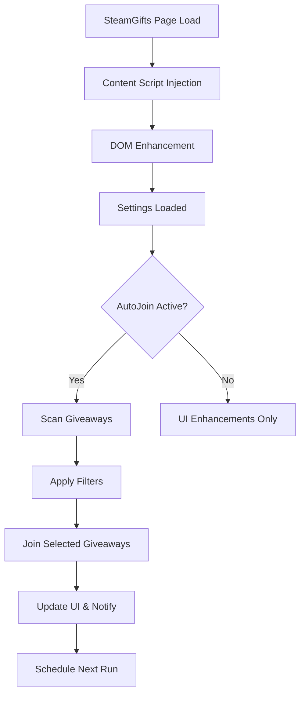

# 🎮 AutoJoin for SteamGifts

<div align="center">

[](https://github.com/bernardopg/AutoJoin-for-SteamGifts/releases)
[](https://opensource.org/licenses/MIT)
[](https://chrome.google.com/webstore)
[](https://addons.mozilla.org/)
[](https://github.com/bernardopg/AutoJoin-for-SteamGifts/actions)

**Extensão inteligente que automatiza sua participação em sorteios do SteamGifts com segurança, elegância e total controle.**

[🇧🇷 Português](#-português-brasil) • [🇺🇸 English](#-english) • [📦 Instalação](#-instalação-rápida) • [🚀 Recursos](#-recursos-principais) • [📖 Documentação](#-documentação)

</div>

---

## 🇧🇷 Português (Brasil)

### 📋 Índice

- [🎯 Visão Geral](#-visão-geral)
- [✨ Recursos Principais](#-recursos-principais)
- [📦 Instalação Rápida](#-instalação-rápida)
- [🎮 Como Usar](#-como-usar)
- [⚙️ Configuração Avançada](#-configuração-avançada)
- [🛠️ Scripts de Desenvolvimento](#-scripts-de-desenvolvimento)
- [🏗️ Arquitetura](#-arquitetura)
- [🔒 Segurança e Privacidade](#-segurança-e-privacidade)
- [🤝 Contribuindo](#-contribuindo)
- [📄 Licença](#-licença)

### 🎯 Visão Geral

**AutoJoin for SteamGifts** é uma extensão moderna e inteligente para navegadores que revoluciona sua experiência no SteamGifts.com. Desenvolvida com **Manifest V3**, oferece automação segura, interface aprimorada e recursos avançados para maximizar suas chances nos sorteios.

#### 🌟 Por que escolher o AutoJoin?

- **🧠 Inteligência Artificial**: Filtragem inteligente baseada em seus critérios
- **🔒 Segurança Total**: Nenhum dado enviado para terceiros, código 100% transparente
- **🎨 Interface Moderna**: Design responsivo com tema escuro elegante
- **⚡ Performance**: Otimizado com Service Workers e técnicas modernas
- **🔄 Sincronização**: Configurações sincronizadas entre dispositivos
- **🌍 Multilíngue**: Suporte completo em Português e Inglês

### ✨ Recursos Principais

#### 🎮 Automação Inteligente

- **Participação Automática**: Entra nos sorteios seguindo seus filtros personalizados
- **Gestão de Pontos**: Controle inteligente de gastos com pontos
- **Filtros Avançados**: Por nível, grupos, listas de desejos e muito mais
- **Agenda Flexível**: Configure horários específicos para ativação

#### 🎨 Interface Aprimorada

- **Tema Escuro Premium**: Design moderno com alta legibilidade
- **Indicadores Visuais**: Odds em tempo real, status de participação
- **Navegação Intuitiva**: Atalhos e melhorias de usabilidade
- **Acessibilidade**: Compatível com leitores de tela e navegação por teclado

#### 🔧 Recursos Técnicos

- **Manifest V3**: Tecnologia de ponta para máxima segurança
- **Service Worker**: Execução em segundo plano otimizada
- **Offscreen Documents**: Processamento HTML isolado e seguro
- **Chrome Storage API**: Sincronização automática entre dispositivos

#### 🛡️ Segurança e Privacidade

- **Zero Telemetria**: Seus dados permanecem totalmente privados
- **Permissões Mínimas**: Apenas o necessário para funcionamento
- **Código Aberto**: Transparência total, auditável por qualquer pessoa
- **Criptografia Local**: Dados protegidos com APIs nativas do navegador

### 📦 Instalação Rápida

#### 🌐 Instalação via Web Store (Recomendado)

```bash
# Em breve nas lojas oficiais
Chrome Web Store: [Em análise]
Firefox Add-ons: [Em análise]
```

#### 🔧 Instalação Manual (Desenvolvedores)

1. **Clone o repositório**:

```bash
git clone https://github.com/bernardopg/AutoJoin-for-SteamGifts.git
cd AutoJoin-for-SteamGifts
```

2. **Instale as dependências**:

```bash
npm install
```

3. **Execute os testes**:

```bash
npm run check
```

4. **Carregue no navegador**:

**Chrome/Edge/Brave:**

- Abra `chrome://extensions/`
- Ative o "Modo do desenvolvedor"
- Clique em "Carregar sem compactação"
- Selecione a pasta do projeto

**Firefox:**

- Abra `about:debugging`
- Clique em "Este Firefox"
- Clique em "Carregar extensão temporária"
- Selecione o arquivo `manifest.json`

### 🎮 Como Usar

#### 🚀 Primeiros Passos

1. **Instale a extensão** seguindo as instruções acima
2. **Visite o SteamGifts.com** - a interface será automaticamente aprimorada
3. **Configure suas preferências** clicando em "AutoJoin Settings" no menu
4. **Ative o AutoJoin** e deixe a mágica acontecer!

#### ⚙️ Configuração Básica

| Configuração | Descrição | Padrão |
|-------------|-----------|--------|
| **Pontos Mínimos** | Reserva mínima de pontos | 50 |
| **Nível Mínimo** | Nível mínimo para participar | 0 |
| **Filtro DLC** | Ignorar conteúdos DLC | Desativado |
| **Tema Escuro** | Interface com tema escuro | Ativado |
| **Notificações** | Alertas de vitórias | Ativado |

#### 🎯 Filtros Avançados

**Listas de Prioridade**:

- **Whitelist**: Jogos que você SEMPRE quer
- **Blacklist**: Jogos que você NUNCA quer
- **Lista de Desejos Steam**: Sincronização automática

**Filtros de Grupo**:

- Participe apenas de grupos específicos
- Exclua grupos indesejados
- Configuração flexível por regex

### ⚙️ Configuração Avançada

#### 🔧 Variáveis de Ambiente

```javascript
// Configurações avançadas (chrome.storage.sync)
const advancedConfig = {
  autoJoinDelay: 2000,        // Delay entre participações (ms)
  maxPointsPerSession: 500,   // Máximo de pontos por sessão
  enableAudioNotifications: true,
  customFilters: {
    minOdds: 0.01,           // Odds mínimas (1%)
    maxEntries: 50000,       // Máximo de participantes
    preferredCategories: ['Action', 'Adventure', 'RPG']
  }
}
```

#### 🎨 Personalização de Tema

```css
/* Variáveis CSS customizáveis */
:root {
  --aj-primary-color: #4A90E2;
  --aj-success-color: #7ED321;
  --aj-warning-color: #F5A623;
  --aj-danger-color: #D0021B;
  --aj-dark-bg: #1a1a1a;
  --aj-card-bg: #2d2d2d;
}
```

### 🛠️ Scripts de Desenvolvimento

```bash
# Instalar dependências
npm install

# Verificação de código
npm run lint          # ESLint
npm run format        # Prettier
npm run check         # Lint + Format

# Testes
npm test              # Testes unitários
npm run test:e2e      # Testes de integração (em breve)

# Build e distribuição
npm run build         # Build para produção
npm run package       # Criar arquivo .zip
npm run release       # Build + Package + Tag
```

### 🏗️ Arquitetura

#### 📁 Estrutura do Projeto

```
AutoJoin-for-SteamGifts/
├── 📁 js/                    # Scripts JavaScript
│   ├── autoentry.js          # Script principal de conteúdo
│   ├── backgroundpage.js     # Service Worker
│   ├── offscreen.js          # Documento offscreen
│   ├── settings.js           # Interface de configurações
│   ├── 📁 core/             # Módulos principais
│   │   ├── giveaway.js       # Modelo de sorteio
│   │   ├── page-enhancements.js # Melhorias de UI
│   │   └── settings-store.js # Gerenciamento de configurações
│   └── utils-enhanced.js     # Utilitários
├── 📁 css/                   # Estilos
│   ├── main.css             # Estilos principais
│   ├── night.css            # Tema escuro
│   ├── animations.css       # Animações
│   └── 📁 fontawesome/      # Ícones
├── 📁 html/                  # Páginas HTML
│   ├── settings.html        # Página de configurações
│   └── offscreen.html       # Documento offscreen
├── 📁 media/                 # Recursos de mídia
├── 📁 tests/                 # Testes
├── 📁 docs/                  # Documentação
└── 📁 .github/              # GitHub Actions
```

#### 🔄 Fluxo de Execução



### 🔒 Segurança e Privacidade

#### 🛡️ Compromisso com a Privacidade

- **❌ Zero Tracking**: Nenhum analytics ou telemetria
- **❌ Sem Terceiros**: Dados nunca saem do seu navegador
- **✅ Código Aberto**: 100% transparente e auditável
- **✅ Permissões Mínimas**: Apenas o essencial para funcionar

#### 🔐 Práticas de Segurança

- **Manifest V3**: Maior segurança e isolamento
- **Content Security Policy**: Proteção contra XSS
- **Validação Rigorosa**: Todos os inputs são validados
- **Criptografia Local**: APIs nativas do navegador

#### 📊 Dados Coletados vs. Armazenados

| Tipo de Dado | Coletado | Armazenado Localmente | Enviado Externamente |
|--------------|----------|---------------------|---------------------|
| Configurações Pessoais | ✅ | ✅ | ❌ |
| Histórico de Sorteios | ✅ | ✅ | ❌ |
| Dados de Navegação | ❌ | ❌ | ❌ |
| Informações Pessoais | ❌ | ❌ | ❌ |
| Telemetria/Analytics | ❌ | ❌ | ❌ |

### 🤝 Contribuindo

Adoramos contribuições da comunidade! Veja como participar:

#### 🐛 Reportando Bugs

1. Verifique se o bug já foi reportado
2. Use nosso [template de issue](.github/ISSUE_TEMPLATE/bug_report.md)
3. Inclua logs e screenshots quando possível

#### 🚀 Sugerindo Recursos

1. Use nosso [template de feature request](.github/ISSUE_TEMPLATE/feature_request.md)
2. Explique o problema que resolve
3. Proponha uma solução detalhada

#### 🔧 Desenvolvendo

1. Faça fork do repositório
2. Crie uma branch: `git checkout -b minha-feature`
3. Commit suas mudanças: `git commit -am 'Adiciona nova feature'`
4. Push para a branch: `git push origin minha-feature`
5. Abra um Pull Request

#### 📋 Checklist para PRs

- [ ] Código segue o estilo do projeto (`npm run check`)
- [ ] Testes passam (`npm test`)
- [ ] Documentação atualizada se necessário
- [ ] Commit messages são descritivos
- [ ] PR descreve as mudanças claramente

### 📄 Licença

Este projeto está licenciado sob a **MIT License** - veja o arquivo [LICENSE](LICENSE) para detalhes.

```
MIT License - Copyright (c) 2024 bernardopg

Você pode usar, copiar, modificar e distribuir este software livremente,
mantendo os avisos de copyright e esta licença.
```

---

## 🇺🇸 English

### 📋 Table of Contents

- [🎯 Overview](#-overview)
- [✨ Key Features](#-key-features)
- [📦 Quick Installation](#-quick-installation)
- [🎮 How to Use](#-how-to-use)
- [⚙️ Advanced Configuration](#-advanced-configuration)
- [🛠️ Development Scripts](#-development-scripts)
- [🏗️ Architecture](#-architecture)
- [🔒 Security & Privacy](#-security--privacy)
- [🤝 Contributing](#-contributing)
- [📄 License](#-license)

### 🎯 Overview

**AutoJoin for SteamGifts** is a modern and intelligent browser extension that revolutionizes your SteamGifts.com experience. Built with **Manifest V3**, it offers secure automation, enhanced interface, and advanced features to maximize your giveaway success rate.

#### 🌟 Why Choose AutoJoin?

- **🧠 Smart AI**: Intelligent filtering based on your criteria
- **🔒 Total Security**: No data sent to third parties, 100% transparent code
- **🎨 Modern Interface**: Responsive design with elegant dark theme
- **⚡ Performance**: Optimized with Service Workers and modern techniques
- **🔄 Sync**: Settings synchronized across devices
- **🌍 Multilingual**: Full support in Portuguese and English

### ✨ Key Features

#### 🎮 Smart Automation

- **Auto Participation**: Joins giveaways following your custom filters
- **Point Management**: Intelligent spending control
- **Advanced Filters**: By level, groups, wishlists and much more
- **Flexible Schedule**: Configure specific activation times

#### 🎨 Enhanced Interface

- **Premium Dark Theme**: Modern design with high readability
- **Visual Indicators**: Real-time odds, participation status
- **Intuitive Navigation**: Shortcuts and usability improvements
- **Accessibility**: Compatible with screen readers and keyboard navigation

#### 🔧 Technical Features

- **Manifest V3**: Cutting-edge technology for maximum security
- **Service Worker**: Optimized background execution
- **Offscreen Documents**: Isolated and secure HTML processing
- **Chrome Storage API**: Automatic synchronization across devices

#### 🛡️ Security & Privacy

- **Zero Telemetry**: Your data remains completely private
- **Minimal Permissions**: Only what's necessary for operation
- **Open Source**: Total transparency, auditable by anyone
- **Local Encryption**: Data protected with native browser APIs

### 📦 Quick Installation

#### 🌐 Web Store Installation (Recommended)

```bash
# Coming soon to official stores
Chrome Web Store: [Under Review]
Firefox Add-ons: [Under Review]
```

#### 🔧 Manual Installation (Developers)

1. **Clone the repository**:

```bash
git clone https://github.com/bernardopg/AutoJoin-for-SteamGifts.git
cd AutoJoin-for-SteamGifts
```

2. **Install dependencies**:

```bash
npm install
```

3. **Run tests**:

```bash
npm run check
```

4. **Load in browser**:

**Chrome/Edge/Brave:**

- Open `chrome://extensions/`
- Enable "Developer mode"
- Click "Load unpacked"
- Select the project folder

**Firefox:**

- Open `about:debugging`
- Click "This Firefox"
- Click "Load Temporary Add-on"
- Select the `manifest.json` file

### 🎮 How to Use

#### 🚀 Getting Started

1. **Install the extension** following the instructions above
2. **Visit SteamGifts.com** - the interface will be automatically enhanced
3. **Configure your preferences** by clicking "AutoJoin Settings" in the menu
4. **Activate AutoJoin** and let the magic happen!

#### ⚙️ Basic Configuration

| Setting | Description | Default |
|---------|-------------|---------|
| **Minimum Points** | Minimum point reserve | 50 |
| **Minimum Level** | Minimum level to participate | 0 |
| **DLC Filter** | Ignore DLC content | Disabled |
| **Dark Theme** | Dark theme interface | Enabled |
| **Notifications** | Victory alerts | Enabled |

### 🔒 Security & Privacy

#### 🛡️ Privacy Commitment

- **❌ Zero Tracking**: No analytics or telemetry
- **❌ No Third Parties**: Data never leaves your browser
- **✅ Open Source**: 100% transparent and auditable
- **✅ Minimal Permissions**: Only essential for operation

#### 🔐 Security Practices

- **Manifest V3**: Enhanced security and isolation
- **Content Security Policy**: XSS protection
- **Rigorous Validation**: All inputs are validated
- **Local Encryption**: Native browser APIs

### 🤝 Contributing

We love community contributions! Here's how to participate:

#### 🐛 Reporting Bugs

1. Check if the bug has already been reported
2. Use our [issue template](.github/ISSUE_TEMPLATE/bug_report.md)
3. Include logs and screenshots when possible

#### 🚀 Suggesting Features

1. Use our [feature request template](.github/ISSUE_TEMPLATE/feature_request.md)
2. Explain the problem it solves
3. Propose a detailed solution

### 📄 License

This project is licensed under the **MIT License** - see the [LICENSE](LICENSE) file for details.

---

## 📖 Documentação

- [📋 Contributing Guide](CONTRIBUTING.md) - Como contribuir para o projeto
- [🔒 Security Policy](SECURITY.md) - Política de segurança e reporte de vulnerabilidades
- [🤖 Agents Guide](AGENTS.md) - Guia para agentes/assistentes automatizados
- [🚀 Warp Development](WARP.md) - Manual específico para warp.dev
- [📚 API Documentation](docs/API.md) - Documentação técnica da API
- [🎨 Design System](docs/DESIGN.md) - Sistema de design e componentes
- [🔧 Development Setup](docs/DEVELOPMENT.md) - Configuração de ambiente de desenvolvimento

## 🏆 Reconhecimentos

- **SteamGifts Community** - Por criar uma plataforma incrível
- **Contributors** - Todos que contribuem para melhorar o projeto
- **Users** - Por usar, testar e dar feedback valioso

## 📊 Estatísticas


---

<div align="center">

**Feito com ❤️ para a comunidade SteamGifts**

[⬆️ Voltar ao Topo](#-autojoin-for-steamgifts)

</div>
