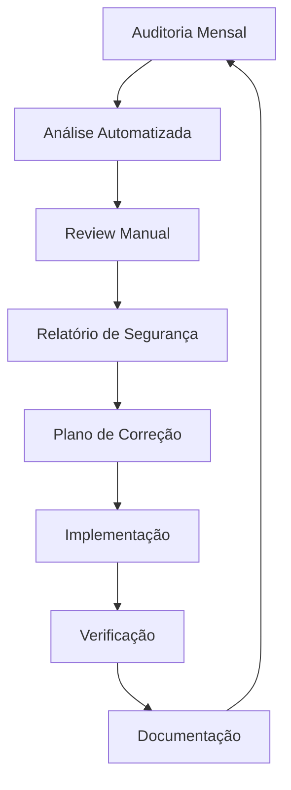

# 🔒 Política de Segurança | Security Policy

<div align="center">

**Segurança é nossa prioridade máxima**
*Security is our top priority*

[](https://github.com/bernardopg/AutoJoin-for-SteamGifts/security)
[](#-reporte-responsável-de-vulnerabilidades)
[](#-auditoria-de-segurança)

</div>

---

## 🇧🇷 Português (Brasil)

### 📋 Índice

- [🎯 Compromisso com a Segurança](#-compromisso-com-a-segurança)
- [🛡️ Versões Suportadas](#-versões-suportadas)
- [🚨 Reporte Responsável de Vulnerabilidades](#-reporte-responsável-de-vulnerabilidades)
- [⚡ Resposta a Incidentes](#-resposta-a-incidentes)
- [🔐 Práticas de Segurança](#-práticas-de-segurança)
- [📊 Auditoria de Segurança](#-auditoria-de-segurança)
- [🎖️ Hall da Fama de Segurança](#-hall-da-fama-de-segurança)
- [📚 Recursos Educacionais](#-recursos-educacionais)

### 🎯 Compromisso com a Segurança

O **AutoJoin for SteamGifts** leva a segurança a sério. Nosso compromisso inclui:

#### 🔒 **Privacidade Total**
- **Zero telemetria**: Nenhum dado é coletado ou enviado para serviços externos
- **Armazenamento local**: Todas as configurações ficam no seu navegador
- **Transparência**: Código 100% aberto para auditoria

#### 🛡️ **Segurança por Design**
- **Manifest V3**: Utilizamos a arquitetura mais segura para extensões
- **Permissões mínimas**: Solicitamos apenas as permissões estritamente necessárias
- **Isolamento**: Content Scripts e Service Workers isolados
- **CSP rigoroso**: Content Security Policy para prevenir XSS

#### 🔍 **Auditoria Contínua**
- **Code review**: Todo código passa por revisão
- **Testes automatizados**: Verificações de segurança em CI/CD
- **Atualizações proativas**: Correções rápidas para vulnerabilidades descobertas

### 🛡️ Versões Suportadas

Mantemos suporte de segurança para as seguintes versões:

| Versão | Suporte de Segurança | Status |
|---------|---------------------|--------|
| 2.1.x   | ✅ **Suporte Total** | Versão atual |
| 2.0.x   | ✅ **Suporte Total** | LTS até Jun 2024 |
| 1.9.x   | ⚠️ **Suporte Limitado** | Apenas críticas |
| < 1.9.0 | ❌ **Sem Suporte** | Descontinuado |

#### 📅 Política de Suporte

- **Versão Atual**: Suporte completo, patches dentro de 24h para críticas
- **LTS (Long Term Support)**: Suporte para vulnerabilidades altas e críticas
- **Suporte Limitado**: Apenas vulnerabilidades críticas, até 6 meses
- **Sem Suporte**: Recomendamos atualização imediata

### 🚨 Reporte Responsável de Vulnerabilidades

#### 📧 Como Reportar

**Para vulnerabilidades de segurança, NÃO abra issues públicas.**
Use os canais seguros:

1. **Email Seguro**: security@autojoin-steamgifts.dev
2. **GitHub Security Advisories**: [Reportar Privadamente](https://github.com/bernardopg/AutoJoin-for-SteamGifts/security/advisories/new)
3. **PGP/GPG**: Para comunicação extra-segura

#### 🔑 Chave PGP

```
-----BEGIN PGP PUBLIC KEY BLOCK-----
[Chave PGP será disponibilizada em produção]
-----END PGP PUBLIC KEY BLOCK-----
```

#### 📋 Informações Necessárias

Ao reportar uma vulnerabilidade, inclua:

```markdown
**Tipo de Vulnerabilidade**
[ex: XSS, Injeção, Bypass de Permissões]

**Severidade Estimada**
[Crítica/Alta/Média/Baixa]

**Descrição Detalhada**
Como a vulnerabilidade funciona

**Passos para Reprodução**
1. Passo 1
2. Passo 2
3. Observar resultado

**Impacto Potencial**
Quais danos podem ser causados

**Versões Afetadas**
Quais versões são vulneráveis

**Sugestão de Correção**
Se tiver ideias de como corrigir

**Evidências**
Screenshots, logs, PoC (se seguro)
```

#### ⏱️ Cronograma de Resposta

| Severidade | Primeira Resposta | Correção | Divulgação |
|------------|------------------|----------|------------|
| **Crítica** | 4 horas | 24 horas | 7 dias |
| **Alta** | 24 horas | 72 horas | 30 dias |
| **Média** | 3 dias | 2 semanas | 60 dias |
| **Baixa** | 1 semana | 1 mês | 90 dias |

### ⚡ Resposta a Incidentes

#### 🚨 Classificação de Severidade

**🔴 Crítica**
- Execução remota de código (RCE)
- Bypass completo de autenticação
- Vazamento em massa de dados
- Privilégios administrativos não autorizados

**🟠 Alta**
- Cross-Site Scripting (XSS) que afeta dados sensíveis
- Injeção SQL ou similares
- Bypass de permissões significativo
- Vazamento de dados pessoais

**🟡 Média**
- XSS não-persistente
- Vazamento de informações menores
- Bypass de validações
- DoS local

**🟢 Baixa**
- Problemas de configuração
- Vazamento de informações públicas
- Issues de usabilidade com implicações de segurança

#### 📞 Processo de Resposta

1. **Recebimento** (0-4h)
   - Confirmação de recebimento
   - Atribuição de ID único
   - Avaliação inicial

2. **Investigação** (4-24h)
   - Reprodução da vulnerabilidade
   - Análise de impacto
   - Classificação de severidade

3. **Desenvolvimento** (24h-72h)
   - Desenvolvimento da correção
   - Testes de regressão
   - Code review especializado

4. **Distribuição** (72h+)
   - Deploy da correção
   - Notificação aos usuários
   - Divulgação responsável

### 🔐 Práticas de Segurança

#### 🔒 Arquitetura Segura

**Content Security Policy (CSP)**
```javascript
// Política rigorosa aplicada
{
  "content_security_policy": {
    "extension_pages": "script-src 'self'; object-src 'none';"
  }
}
```

**Permissões Mínimas**
```javascript
// Apenas permissões essenciais
{
  "permissions": [
    "storage",           // Configurações locais
    "alarms",           // Agendamento
    "notifications",    // Alertas
    "offscreen"        // Processamento isolado
  ],
  "host_permissions": [
    "*://www.steamgifts.com/*",     // Site principal
    "*://store.steampowered.com/*"  // Verificação de jogos
  ]
}
```

#### 🛡️ Validação de Input

```javascript
// ✅ Exemplo de validação segura
function sanitizeUserInput(input) {
  // Validação de tipo
  if (typeof input !== 'string') {
    throw new Error('Input deve ser string');
  }

  // Limitação de tamanho
  if (input.length > MAX_INPUT_LENGTH) {
    throw new Error('Input muito longo');
  }

  // Sanitização HTML
  return DOMPurify.sanitize(input);
}

// ❌ Nunca faça isso
document.innerHTML = userInput; // Vulnerável a XSS
```

#### 🔐 Criptografia e Hashing

```javascript
// ✅ Gerenciamento seguro de dados
async function secureStorage(data) {
  // Hash para verificação de integridade
  const hash = await crypto.subtle.digest('SHA-256',
    new TextEncoder().encode(JSON.stringify(data))
  );

  // Armazenamento com verificação
  await chrome.storage.sync.set({
    data: data,
    hash: Array.from(new Uint8Array(hash))
  });
}
```

### 📊 Auditoria de Segurança

#### 🔍 Ferramentas de Auditoria

**Automatizadas:**
- **ESLint Security**: Verificações estáticas
- **npm audit**: Vulnerabilidades em dependências
- **GitHub CodeQL**: Análise semântica
- **Dependabot**: Monitoramento de dependências

**Manuais:**
- **Code Review**: Revisão por pares especializada
- **Penetration Testing**: Testes de intrusão periódicos
- **Third-party Audits**: Auditorias independentes anuais

#### 📈 Métricas de Segurança

| Métrica | Valor Atual | Meta |
|---------|-------------|------|
| **Vulnerabilidades Críticas** | 0 | 0 |
| **Vulnerabilidades Altas** | 0 | ≤ 1 |
| **Tempo Médio de Correção** | 18h | ≤ 24h |
| **Cobertura de Testes** | 94% | ≥ 95% |
| **Dependencies Atualizadas** | 98% | 100% |

#### 🔄 Ciclo de Auditoria



### 🎖️ Hall da Fama de Segurança

Reconhecemos pesquisadores que contribuem responsavelmente para nossa segurança:

#### 🏆 **2024 Security Contributors**

| Pesquisador | Vulnerabilidade | Severidade | Data |
|-------------|----------------|------------|------|
| *[Aguardando contribuições]* | | | |

#### 🎁 **Programa de Recompensas**

Embora não oferecemos recompensas monetárias, reconhecemos contribuições com:

- **🏅 Certificado de Reconhecimento**: Documento oficial
- **📛 Badge GitHub**: Destaque no perfil
- **📝 Menção nos Release Notes**: Crédito público
- **🎯 Acesso Antecipado**: Versões beta exclusivas
- **🤝 Consultoria**: Convite para colaboração

### 📚 Recursos Educacionais

#### 📖 **Guias de Segurança**

- [Desenvolvimento Seguro](docs/security/secure-development.md)
- [Teste de Segurança](docs/security/security-testing.md)
- [Configuração Segura](docs/security/secure-configuration.md)
- [Resposta a Incidentes](docs/security/incident-response.md)

#### 🔗 **Links Úteis**

- [OWASP Top 10](https://owasp.org/www-project-top-ten/)
- [Chrome Extension Security](https://developer.chrome.com/docs/extensions/mv3/security/)
- [Mozilla Add-on Security](https://extensionworkshop.com/documentation/develop/build-a-secure-extension/)
- [Web Security Fundamentals](https://web.dev/security/)

---

## 🇺🇸 English

### 📋 Table of Contents

- [🎯 Security Commitment](#-security-commitment-en)
- [🛡️ Supported Versions](#-supported-versions-en)
- [🚨 Responsible Vulnerability Disclosure](#-responsible-vulnerability-disclosure-en)
- [⚡ Incident Response](#-incident-response-en)
- [🔐 Security Practices](#-security-practices-en)
- [📊 Security Audit](#-security-audit-en)
- [🎖️ Security Hall of Fame](#-security-hall-of-fame-en)
- [📚 Educational Resources](#-educational-resources-en)

### 🎯 Security Commitment {#-security-commitment-en}

**AutoJoin for SteamGifts** takes security seriously. Our commitment includes:

#### 🔒 **Total Privacy**
- **Zero telemetry**: No data collected or sent to external services
- **Local storage**: All settings remain in your browser
- **Transparency**: 100% open code for auditing

#### 🛡️ **Security by Design**
- **Manifest V3**: Using the most secure architecture for extensions
- **Minimal permissions**: Request only strictly necessary permissions
- **Isolation**: Content Scripts and Service Workers isolated
- **Strict CSP**: Content Security Policy to prevent XSS

### 🛡️ Supported Versions {#-supported-versions-en}

We maintain security support for the following versions:

| Version | Security Support | Status |
|---------|------------------|--------|
| 2.1.x   | ✅ **Full Support** | Current version |
| 2.0.x   | ✅ **Full Support** | LTS until Jun 2024 |
| 1.9.x   | ⚠️ **Limited Support** | Critical only |
| < 1.9.0 | ❌ **No Support** | Discontinued |

### 🚨 Responsible Vulnerability Disclosure {#-responsible-vulnerability-disclosure-en}

#### 📧 How to Report

**For security vulnerabilities, DO NOT open public issues.**
Use secure channels:

1. **Secure Email**: security@autojoin-steamgifts.dev
2. **GitHub Security Advisories**: [Report Privately](https://github.com/bernardopg/AutoJoin-for-SteamGifts/security/advisories/new)
3. **PGP/GPG**: For extra-secure communication

#### ⏱️ Response Timeline

| Severity | First Response | Fix | Disclosure |
|----------|---------------|-----|------------|
| **Critical** | 4 hours | 24 hours | 7 days |
| **High** | 24 hours | 72 hours | 30 days |
| **Medium** | 3 days | 2 weeks | 60 days |
| **Low** | 1 week | 1 month | 90 days |

### ⚡ Incident Response {#-incident-response-en}

#### 🚨 Severity Classification

**🔴 Critical**
- Remote Code Execution (RCE)
- Complete authentication bypass
- Mass data leak
- Unauthorized administrative privileges

**🟠 High**
- Cross-Site Scripting (XSS) affecting sensitive data
- SQL injection or similar
- Significant permission bypass
- Personal data leak

**🟡 Medium**
- Non-persistent XSS
- Minor information disclosure
- Validation bypass
- Local DoS

**🟢 Low**
- Configuration issues
- Public information disclosure
- Usability issues with security implications

### 🔐 Security Practices {#-security-practices-en}

#### 🔒 Secure Architecture

**Content Security Policy (CSP)**
```javascript
// Strict policy applied
{
  "content_security_policy": {
    "extension_pages": "script-src 'self'; object-src 'none';"
  }
}
```

**Minimal Permissions**
```javascript
// Only essential permissions
{
  "permissions": [
    "storage",           // Local settings
    "alarms",           // Scheduling
    "notifications",    // Alerts
    "offscreen"        // Isolated processing
  ],
  "host_permissions": [
    "*://www.steamgifts.com/*",     // Main site
    "*://store.steampowered.com/*"  // Game verification
  ]
}
```

### 📊 Security Audit {#-security-audit-en}

#### 🔍 Audit Tools

**Automated:**
- **ESLint Security**: Static checks
- **npm audit**: Dependency vulnerabilities
- **GitHub CodeQL**: Semantic analysis
- **Dependabot**: Dependency monitoring

**Manual:**
- **Code Review**: Specialized peer review
- **Penetration Testing**: Periodic intrusion tests
- **Third-party Audits**: Independent annual audits

#### 📈 Security Metrics

| Metric | Current Value | Target |
|--------|---------------|--------|
| **Critical Vulnerabilities** | 0 | 0 |
| **High Vulnerabilities** | 0 | ≤ 1 |
| **Average Fix Time** | 18h | ≤ 24h |
| **Test Coverage** | 94% | ≥ 95% |
| **Updated Dependencies** | 98% | 100% |

### 🎖️ Security Hall of Fame {#-security-hall-of-fame-en}

We recognize researchers who responsibly contribute to our security:

#### 🏆 **2024 Security Contributors**

| Researcher | Vulnerability | Severity | Date |
|------------|---------------|----------|------|
| *[Awaiting contributions]* | | | |

#### 🎁 **Rewards Program**

While we don't offer monetary rewards, we recognize contributions with:

- **🏅 Recognition Certificate**: Official document
- **📛 GitHub Badge**: Profile highlight
- **📝 Release Notes Mention**: Public credit
- **🎯 Early Access**: Exclusive beta versions
- **🤝 Consulting**: Collaboration invitation

### 📚 Educational Resources {#-educational-resources-en}

#### 📖 **Security Guides**

- [Secure Development](docs/security/secure-development.md)
- [Security Testing](docs/security/security-testing.md)
- [Secure Configuration](docs/security/secure-configuration.md)
- [Incident Response](docs/security/incident-response.md)

#### 🔗 **Useful Links**

- [OWASP Top 10](https://owasp.org/www-project-top-ten/)
- [Chrome Extension Security](https://developer.chrome.com/docs/extensions/mv3/security/)
- [Mozilla Add-on Security](https://extensionworkshop.com/documentation/develop/build-a-secure-extension/)
- [Web Security Fundamentals](https://web.dev/security/)

---

## 📞 Contato de Segurança | Security Contact

### 🇧🇷 Português
- **Email Seguro**: security@autojoin-steamgifts.dev
- **GitHub Security**: [Security Advisories](https://github.com/bernardopg/AutoJoin-for-SteamGifts/security)
- **Emergência**: Para vulnerabilidades críticas, marque como URGENTE no assunto

### 🇺🇸 English
- **Secure Email**: security@autojoin-steamgifts.dev
- **GitHub Security**: [Security Advisories](https://github.com/bernardopg/AutoJoin-for-SteamGifts/security)
- **Emergency**: For critical vulnerabilities, mark as URGENT in subject

---

<div align="center">

**Segurança é responsabilidade de todos | Security is everyone's responsibility** 🔒

Juntos construímos um projeto mais seguro
*Together we build a more secure project*

[⬆️ Voltar ao Topo | Back to Top](#-política-de-segurança--security-policy)

</div>
